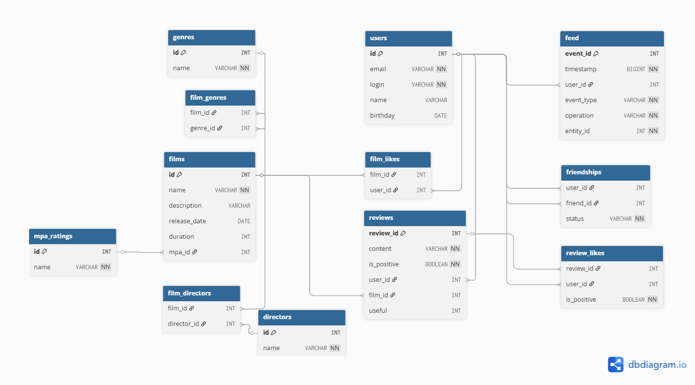

# java-filmorate
Template repository for Filmorate project.

##  Database schema

Below is the database diagram reflecting the structure of the **Filmorate** project:



## SQL Query Examples

### Get all films
```sql
SELECT * 
FROM films;
````

### Get film by ID

```sql
SELECT * 
FROM films 
WHERE id = 1;
```

### Get all users

```sql
SELECT * 
FROM users;
```

### Get user by ID

```sql
SELECT * 
FROM users 
WHERE id = 1;
```

### Get top 10 popular films by likes count

```sql
SELECT f.*, COUNT(fl.user_id) AS likes
FROM films AS f
LEFT JOIN film_likes AS fl ON f.id = fl.film_id
GROUP BY f.id
ORDER BY likes DESC
LIMIT 10;
```

### Get mutual friends of two users

```sql
SELECT u.*
FROM users AS u
JOIN friendships AS f1 ON u.id = f1.friend_id
JOIN friendships AS f2 ON u.id = f2.friend_id
WHERE f1.user_id = 1 
  AND f2.user_id = 2 
  AND f1.status = 'CONFIRMED' 
  AND f2.status = 'CONFIRMED';
```

### Get all film genres

```sql
SELECT g.*
FROM genres AS g
JOIN film_genres AS fg ON g.id = fg.genre_id
WHERE fg.film_id = 1;
```

### Get film rating

```sql
SELECT mr.*
FROM mpa_ratings AS mr
JOIN films AS f ON f.mpa_id = mr.id
WHERE f.id = 1;
```

### Get film directors

```sql
SELECT d.*
FROM directors d
JOIN film_directors fd ON d.id = fd.director_id
WHERE fd.film_id = 1;
```

### Get films by specific director

```sql
SELECT f.*
FROM films f
JOIN film_directors fd ON f.id = fd.film_id
JOIN directors d ON fd.director_id = d.id
WHERE d.name = 'Christopher Nolan';
```

### Get user feed

```sql
SELECT *
FROM feed
WHERE user_id = 1
ORDER BY timestamp DESC;
```

### Get most popular genres

```sql
SELECT g.name, COUNT(fg.film_id) as film_count
FROM genres g
JOIN film_genres fg ON g.id = fg.genre_id
GROUP BY g.id, g.name
ORDER BY film_count DESC;
```